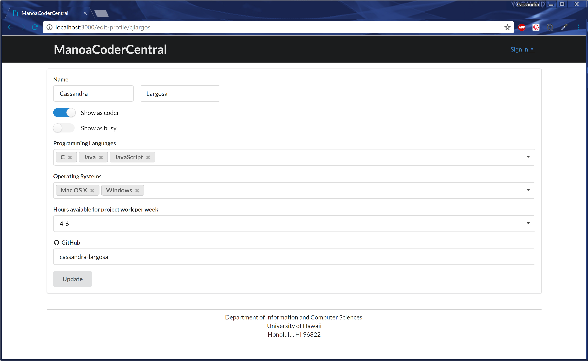
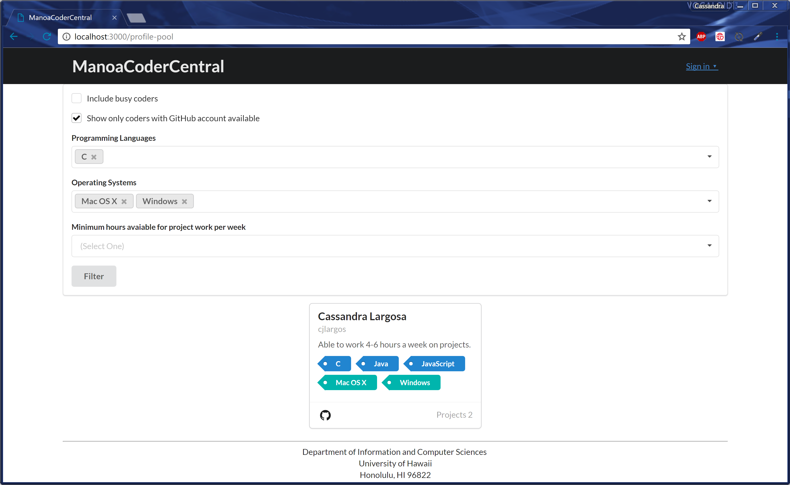
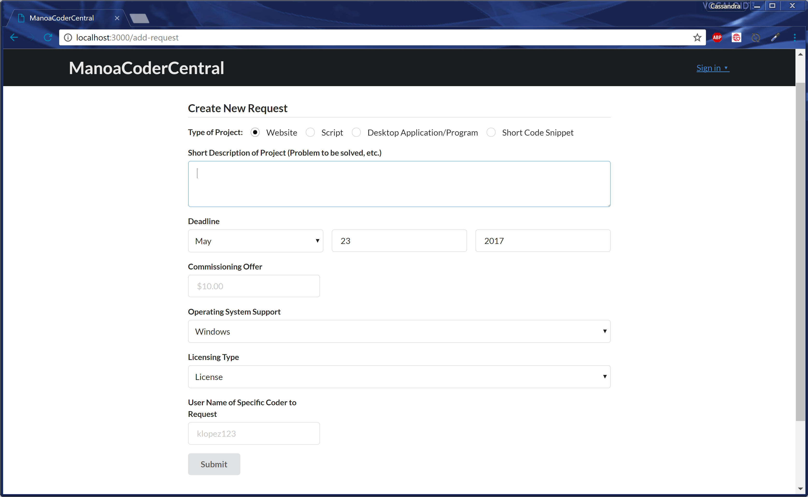
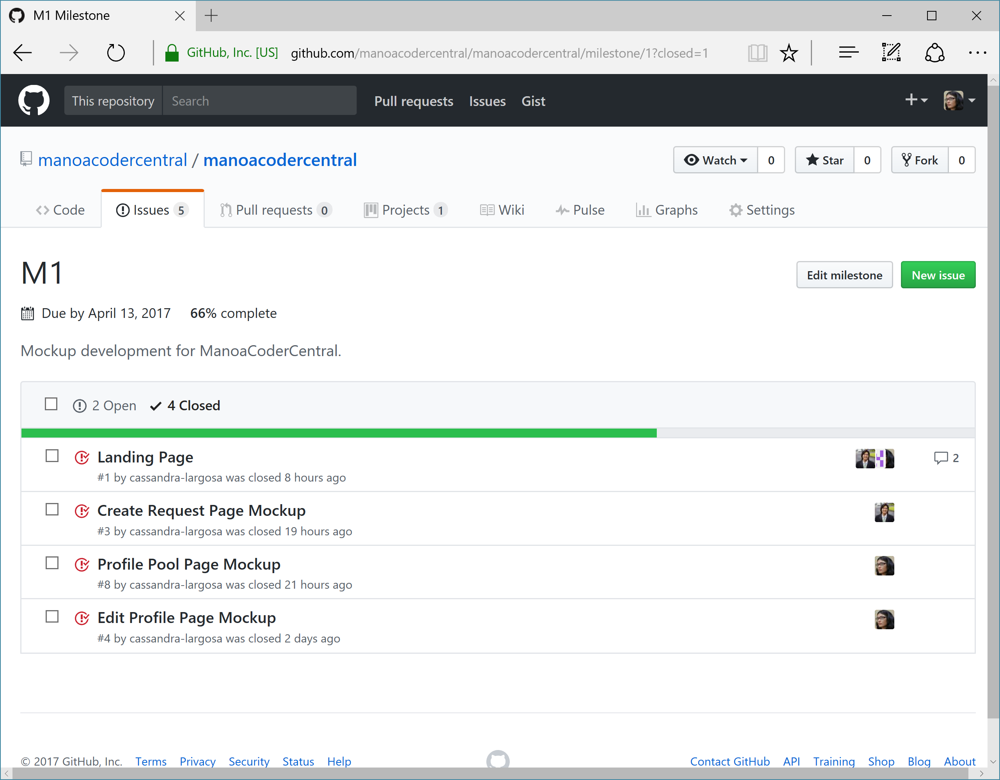
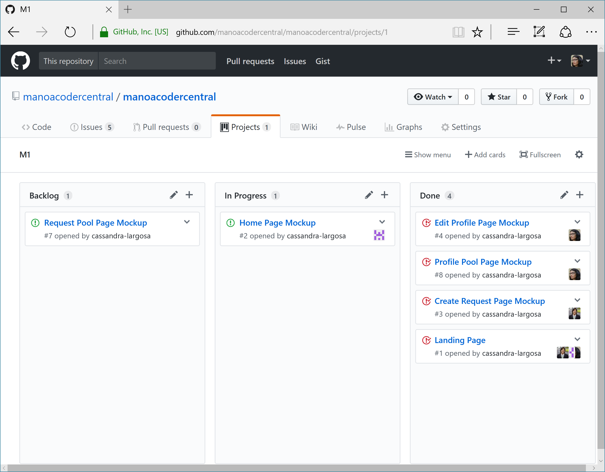
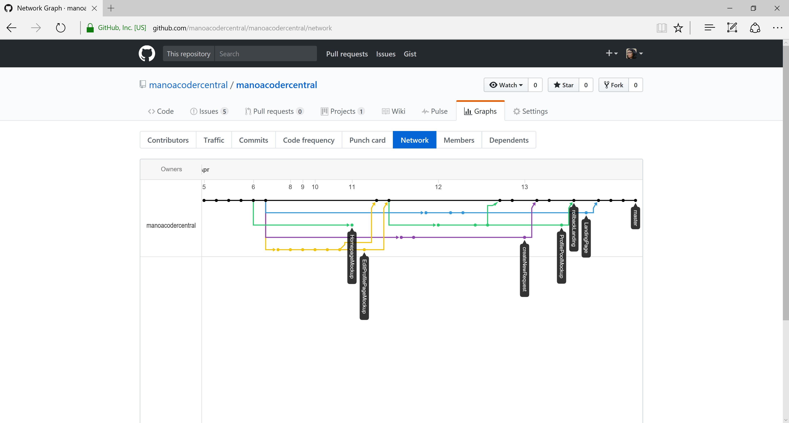

# Table of Contents

- [About ManoaCoderCentral](#about-manoacodercentral)
- [Installation](#installation)
- [Development History](#development-history)
  - [Milestone 1: Mockup Development](#milestone-1-mockup-development)

# About ManoaCoderCentral
ManoaCoderCentral is a Meteor application providing a place to request student coders at the University of Hawaii to work on a project.

# Installation
[Install Meteor](https://www.meteor.com/install).

[Download ManoaCoderCentral](https://github.com/manoacodercentral/manoacodercentral/archive/master.zip) or clone with git.

Then, cd into the app/ directory and install libraries with:

```
$ meteor npm install
```

Run the application with:

```
$ meteor npm run start
```

If no issues arise, the applications will appear at [http://localhost:3000](http://localhost:3000).

# Development History
<a href="https://docs.google.com/a/hawaii.edu/drawings/d/18d-YgDrc5_pzB9v8Hsrmqk73pjkqIwE5b2TjRzAYoKc/edit?usp=sharing">Google drawing link</a>


## Milestone 1: Mockup Development

Work for Milestone 1 began on April 6, 2017 and ended on April 13, 2017.

The goal was to create mockup pages for the system. The pages were created as a Meteor app to simplify the development process.

Mockups for the following pages were completed during Milestone 1.






Milestone 1 was implemented as [ManoaCoderCentral GitHub Milestone M1](https://github.com/manoacodercentral/manoacodercentral/milestone/1?closed=1).



Progress of Milestone one was managed by [ManoaCoderCentral GitHub Project M1](https://github.com/manoacodercentral/monoacodercentral/projects/1).



Each issues was implemented in its own branch and merged into master upon completion. Occasionally one or two line changes were implemented directly in master when not part of an issue.


